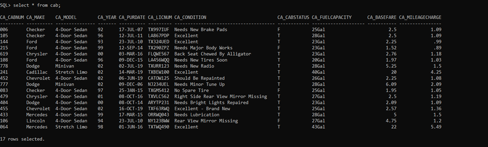
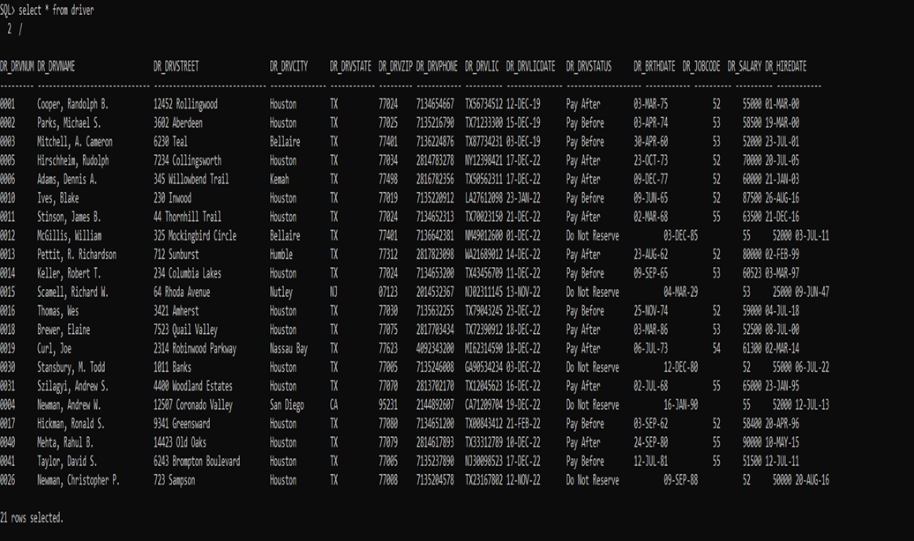
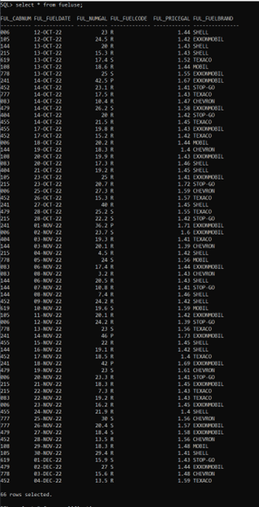
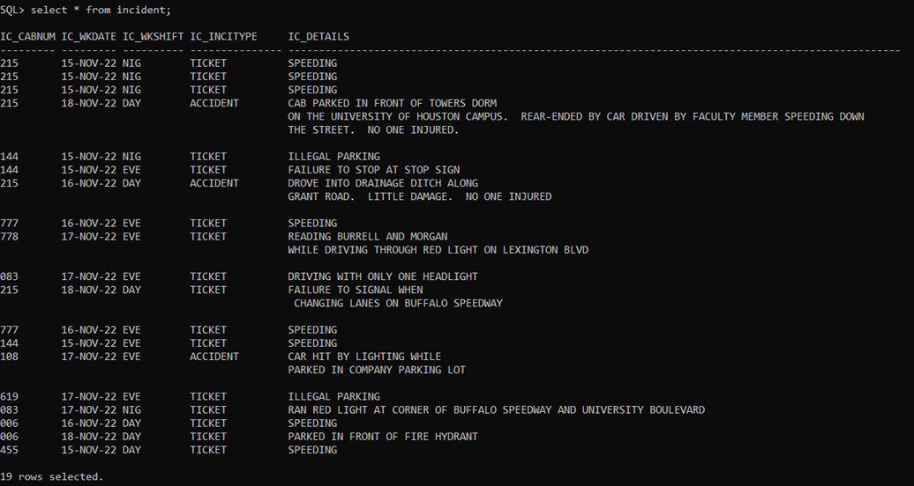
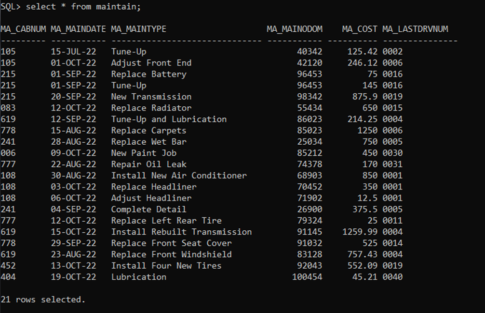
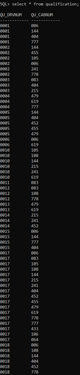
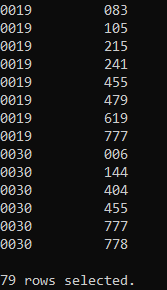
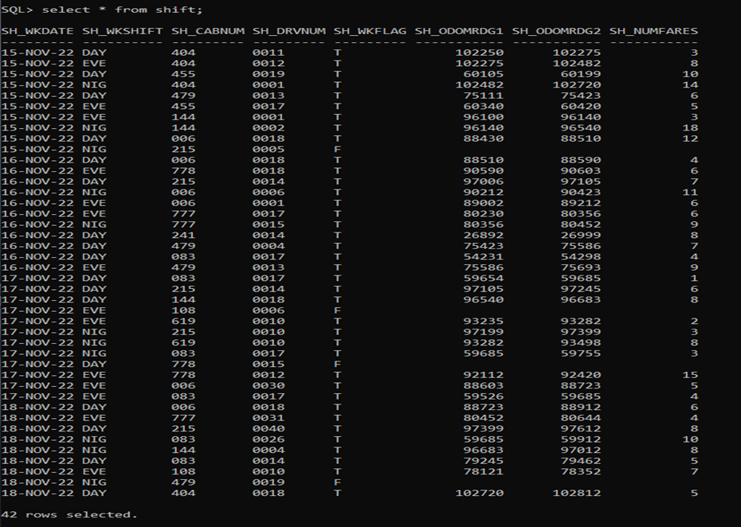

# AdvancedJoinsSQL

# Introduction

This project’s purpose is to practice a wide variety of advanced SQL techniques such as subqueries, complex joins, and null value queries.  

In the realm of transportation and logistics, the taxicab industry forms a significant portion of the landscape. Taxi cabs not only serve the public in getting from one place to another but also contribute to a city's economic structure. The data revolving around taxicab operations can present a wealth of insights - from cab maintenance to shift patterns, driver performance to cost analysis, and beyond. This project dives deep into analyzing an extensive dataset from a hypothetical taxicab company.

The dataset contains information about cabs, their drivers, shifts, maintenance details, fuel usage, driver qualifications, and incident records. This multi-faceted data provides an opportunity to explore multiple aspects of the business, enabling a comprehensive understanding of the operations and performance of the taxicab company.

# Problem Statement

The aim of this project is to extract meaningful insights from the dataset and solve complex queries that can aid the taxicab company in improving its operations, maintenance, driver management, and overall efficiency.

Key questions to be addressed include:

How can the company optimize its cab maintenance schedule and cost?
How can driver performance be assessed and improved?
What are the trends in cab usage across different shifts and days?
What are the factors affecting fuel usage, and how can it be optimized?
How can the company better manage incidents and minimize their occurrences?

# Data Sourcing
The data table was given to us in file format. 
The data for this analysis has been sourced from a hypothetical comprehensive data set that contains information about a taxicab company. This dataset, although fictional, represents a detailed picture of the industry's functioning and includes elements such as driver details, cab details, shift schedules, incident records, cab maintenance records, and fuel consumption patterns.

In terms of structure, the dataset spans multiple tables, each providing a different aspect of the business operations. These tables, through well-established relationships and connections, create a holistic network of information that presents a clear vision of the taxicab company's operations. For instance, the data includes the details of each driver, their qualifications, shifts they've driven, and fares they've collected. Similarly, for each cab, the make, model, maintenance history, fuel usage, and incident records are included.

Overall, the diverse nature and complexity of this dataset make it a highly valuable resource for conducting an in-depth analysis of taxicab operations. It offers a real-world example of the various dimensions involved in managing a taxicab company.

# Data Modeling

# Analysis
The analysis of this project will be divided into various parts, each focusing on a different aspect of taxicab operations.

Cab Maintenance Analysis: This section will focus on understanding the maintenance patterns and costs associated with different cabs.

Driver Performance Analysis: Here, we will assess the performance of drivers based on various factors like the number of shifts driven, incidents involved in, fares collected, etc.

Shift Pattern Analysis: This part will explore the trends in cab usage across different shifts and days, helping to identify peak and off-peak periods.

Fuel Usage Analysis: In this section, we will look at factors affecting fuel usage, and explore ways to reduce fuel costs.

Incident Analysis: Finally, we will analyze the incident data to understand their common causes and the most affected drivers and cabs, with the goal of minimizing their occurrences in the future.

In conclusion, the analysis aims to provide actionable insights that can help the taxicab company improve its operations, ensure efficient use of resources, enhance driver performance, and deliver better service to its customers.

# Data Visualization

# Conclusion
Our comprehensive analysis of the taxicab operations dataset has provided valuable insights and addressed several questions concerning the efficiency and effectiveness of the company's operations. Key findings include the identification of drivers who have performed exceptionally well in terms of fare collections, shifts that are most frequently driven, and makes of cabs that have the highest incidents.

Furthermore, our study has highlighted the importance of effective resource allocation, particularly in terms of cab maintenance and driver shift scheduling. The analysis of cabs with the smallest fuel capacity revealed the need for better fuel management and optimization of shifts driven by these cabs. We also noted the crucial role of driver qualifications in ensuring safe and efficient operations.

Looking at incident data, we identified potential issues regarding data integrity, with some incidents involving drivers who were not qualified to drive the associated cabs. Addressing this problem would require stricter controls and verification processes during shift scheduling.

In the context of shifts, our analysis has led to the identification of drivers without a middle initial, providing additional insights into the driver demographics. We also identified certain trends in shifts driven by drivers qualified for the associated cabs and potential issues when this was not the case.

With this analysis, we aim to provide actionable insights into the taxicab company. By addressing the highlighted issues and adopting the recommended strategies, the company can improve its operations, enhance its efficiency, and ensure better service for its customers. To monitor the effectiveness of these recommendations, regular assessments using similar analyses would be beneficial.

While the current dataset has been invaluable in providing these insights, future analyses could be improved with the inclusion of additional data, such as customer feedback and ratings, detailed geographical data for better route management, and more granular information about incident types and causes. With this additional information, even more, targeted recommendations could be made to further optimize taxi cab operations.

Finally, we believe that the conclusions derived from this analysis not only address the immediate questions posed by the hypothetical company's management but also provide a roadmap for continued analysis and improvement. We look forward to seeing how these insights can help shape better taxicab operations in the future.

# Queries Performed
The Queries 
1. Display the name and age of the oldest driver. 
`code` SELECT dr_drvname, (sysdate - dr_brthdate) / 365.25 AS Age
FROM driver
WHERE (sysdate - dr_brthdate) / 365.25 = (
  SELECT MAX((sysdate - dr_brthdate) / 365.25) FROM driver)
ORDER BY Age DESC;

2. Display all drivers who earn less than $56,000 a year. The resulting list should be ordered on driver status in ascending order and within each driver status in descending order by salary. 
`code` select dr_drvname, dr_salary, dr_drvstatus from driver
where dr_salary < 56000
ORDER BY dr_salary DESC, dr_drvstatus ASC
/
3. Display the name and hiredate of all drivers who were hired between January 1, 1940 and December 12, 2005. Display the qualifying drivers in ascending order by name. Please see the attached handout “Some Brief Examples Using Dates” for examples of how to reference a date in a WHERE clause. We’ll be talking much more about dates in the next several classes but this handout will get you started. 
`code` select dr_drvname, dr_hiredate from driver
where dr_hiredate between '01-JAN-1940' and '12-DEC-2005'
ORDER BY dr_hiredate ASC
/
4. Display the cab number, make, and model of all cabs that are not reserved for either November 15, 2022 or November 16, 2022. In order to be displayed, a cab cannot be reserved on either of these two days. In other words, if a cab is reserved on November 15 but not on November 16, it would not be displayed. Likewise, if the cab were reserved on November 16 but not on November 15, it would not be displayed. Thus the cab would only be displayed if it were not reserved on November 15 and also not reserved on November 16. 
`code` select ca_cabnum, ca_make, ca_model
from cab
where ca_cabnum NOT IN (select sh_cabnum from shift WHERE sh_wkdate between '15-NOV-22' AND '16-NOV-22')
/
5. Display the name of the driver along with the make and model of the cab for all shifts that were scheduled but not driven on November 15, 2022. The scope of this query is limited to just the shifts on November 15, 2022. A shift is scheduled but not driven if Sh_wkflag is equal to ‘F’ or if Sh_wkflag is a null value. 
`code` SELECT DR_DRVNAME, CA_MAKE, CA_MODEL
FROM DRIVER
JOIN SHIFT ON DRIVER.DR_DRVNUM = SHIFT.SH_DRVNUM
JOIN CAB ON SHIFT.SH_CABNUM = CAB.CA_CABNUM
WHERE SH_WKDATE = '15-NOV-22' AND (SH_WKFLAG = 'F' OR SH_WKFLAG IS NULL)
/
6. Display the names of the drivers who were involved in an incident on November 15, 2022, ordered by driver number. In addition, please indicate the cab driven and the type of incident. 
`code` SELECT DISTINCT DR_DRVNUM, DR_DRVNAME, IC_CABNUM, IC_INCITYPE
FROM DRIVER
JOIN SHIFT ON DRIVER.DR_DRVNUM = SHIFT.SH_DRVNUM
JOIN INCIDENT ON SHIFT.SH_CABNUM = INCIDENT.IC_CABNUM AND SHIFT.SH_WKDATE = INCIDENT.IC_WKDATE AND SHIFT.SH_WKSHIFT = INCIDENT.IC_WKSHIFT
WHERE INCIDENT.IC_WKDATE = '15-NOV-22'
ORDER BY DR_DRVNUM
/
7. Display the cab number, make, model, and year of all cabs that have had maintenance where something was either not "replaced" or not "new". Suggestion: you might consider writing a subquery that identifies that set of cabs that have had maintenance where something was either replaced or something new installed and then develop a main query that identifies those cabs not included in the set of cabs identified by the subquery. Pattern matching might come in handy here. You might also want to account for the different ways that words like “new” and “replace” might possibly appear in the MAINTENANCE table just to play it safe. 
`code` SELECT CA_CABNUM, CA_MAKE, CA_MODEL, CA_YEAR
FROM CAB
WHERE CA_CABNUM NOT IN (
  SELECT MA_CABNUM
  FROM MAINTAIN
  WHERE
    UPPER(MA_MAINTYPE) LIKE '%REPLACE%' OR
    UPPER(MA_MAINTYPE) LIKE '%NEW%'
)
/
8. Display the maximum, the minimum and the average salary for all drivers in each driver status. The functions required for this query are illustrated in an example on page 24 of the SQL Potpourri Handout. . 
9. Display the names of those drivers who have never been assigned to drive a shift. 
`code` SELECT DR_DRVNUM, DR_DRVNAME
FROM DRIVER
WHERE DR_DRVNUM NOT IN (SELECT DISTINCT SH_DRVNUM FROM SHIFT)
/
10. Display the names and ages of all drivers under the age of 55 who have driven one of the Checker cabs at least one time.
`code` select distinct dr_drvname, (sysdate-dr_brthdate)/365.25 AS AGE
from driver
JOIN shift on dr_drvnum = sh_drvnum
JOIN cab ON sh_cabnum = ca_cabnum
where ca_make like 'Checker' and (sysdate-dr_brthdate)/365.25 < 55
/
11. Display the names of all drivers who have a jobcode of 52 and who have a driver status other than "Do Not Reserve". Please display the first name followed by the middle initial and the last name of each driver. 
`code` SELECT DR_DRVNUM, DR_DRVNAME
FROM DRIVER
WHERE DR_JOBCODE = 52 AND DR_DRVSTATUS != 'Do Not Reserve'
/
12. Display the phone numbers of all drivers with a jobcode of 53 or 55. This listing should be ordered by jobcode and within jobcode by driver name and driver phone. In addition, the area code of the phone number should be separated from the first three digits by a hyphen and the first three digits of the phone number should be separated from the last four digits by another hyphen. 
`code` SELECT
       SUBSTR(dr_drvphone, 1, 3) || '-' || SUBSTR(dr_drvphone, 4, 3) || '-' || SUBSTR(dr_drvphone, 7) AS formatted_phone_number, dr_jobcode, dr_drvname
FROM driver
where dr_jobcode = 53 OR dr_jobcode = 55
Order by dr_jobcode desc
/
13. Display the number of drivers born in each year. 
`code` SELECT SUBSTR(TO_CHAR(DR_BRTHDATE, 'YYYY'), 1, 4) AS BIRTH_YEAR, COUNT(*) AS NUM_DRIVERS
FROM DRIVER
GROUP BY SUBSTR(TO_CHAR(DR_BRTHDATE, 'YYYY'), 1, 4)
ORDER BY BIRTH_YEAR
/
14. Display the names of all drivers in order by driver name who are scheduled to drive the day shift between November 14, 2022 and November 18, 2022 inclusive. 
`code` select dr_drvname, sh_wkdate, sh_wkshift
from driver, shift
where dr_drvnum = sh_drvnum AND sh_wkshift like 'DAY' AND sh_wkdate between '14-NOV-22' and '18-NOV-22'
order by dr_drvname
/
15. Display a list of all cabs not reserved for the day shift on November 15, 2022. Include in the list the number, make, model and year of the cab. The scope of this query is limited to just the shifts on November 15, 2022. Cabs not driven at all on November 15 should be included as part of the output of this query. 
`code` SELECT CA_CABNUM, CA_MAKE, CA_MODEL, CA_YEAR
FROM CAB
WHERE CA_CABNUM NOT IN (
  SELECT SH_CABNUM
  FROM SHIFT
  WHERE SH_WKDATE = TO_DATE('15-NOV-2022', 'DD-MON-YYYY') AND SH_WKSHIFT = 'DAY')
/
16. Display the total number of miles driven during each day and shift combination. Exclude all shifts that have not been driven (i.e., where Sh_wkflag = 'F').
`code` SELECT SH_WKDATE, SH_WKSHIFT, SUM(SH_ODOMRDG2 - SH_ODOMRDG1) AS Total_Miles
FROM SHIFT
WHERE SH_WKFLAG <> 'F'
GROUP BY SH_WKDATE, SH_WKSHIFT
ORDER BY SH_WKDATE, SH_WKSHIFT
/
 17. Display the average mileage driven during each day and shift for only the day and evening shifts. 
`code` SELECT SH_WKDATE, SH_WKSHIFT, AVG(SH_ODOMRDG2 - SH_ODOMRDG1) AS Average_Miles
FROM SHIFT
WHERE SH_WKSHIFT IN ('DAY', 'EVE')
GROUP BY SH_WKDATE, SH_WKSHIFT
ORDER BY SH_WKDATE, SH_WKSHIFT
/
18. Display all cabs with a cab number that begins with the digit zero (0). The results should be displayed in order by the make of the cab and then by the date of purchase. 
`code` select ca_cabnum, ca_make, ca_purdate from cab
where ca_cabnum like '0%'
ORDER BY ca_purdate, ca_make
/
19. Display the name, age, and tenure with the company in years for all drivers scheduled to drive the night shift on November 15, 2022.
`code` SELECT DR_DRVNAME, (CURRENT_DATE - DR_BRTHDATE) / 365.25 AS Age, (CURRENT_DATE - DR_HIREDATE) / 365.25 AS Tenure
FROM DRIVER
JOIN SHIFT ON DRIVER.DR_DRVNUM = SHIFT.SH_DRVNUM
WHERE SH_WKDATE = '15-NOV-22' AND SH_WKSHIFT = 'NIG'
/
20. Display the name, make, model and year for all cabs that have had some type of "replacement". Be sure to account for the different cases that could be used to used to represent words like “replace” and “replacement.
`code` select ca_cabnum, ca_make, ca_model, ca_year, ma_maintype
from cab, maintain
where ca_cabnum = ma_cabnum AND (ma_maintype like 'R%e%' and ma_maintype like 'Replace%')
/
21. Display the license number, cab number, year made, and make of all Checker cabs made after 1995. Separate the state from the license number by a space. Also display the cab number, year and make. 
`code` select SUBSTR(ca_licnum, 1, 2) || ' ' || SUBSTR(ca_licnum, 3) AS formatted_plate, ca_cabnum, ca_year, ca_make
from cab
where ca_make like 'Checker' and ca_year > 95
/
22. Display all drivers whose name starts with the letter "S" and who live in Houston. Order the results in ascending order by driver name. 
`code` select dr_drvname, dr_drvstate
from driver
where dr_drvstate = 'TX' and dr_drvname LIKE 'S%'
order by dr_drvname ASC
/
23. Display all drivers who live in Houston who earn more than the average salary of all drivers. The list should be displayed in ascending order by the driver name. 
`code` select dr_drvname, dr_drvcity, dr_salary
from driver
where dr_drvcity like 'Houston'
group by dr_drvname, dr_drvcity, dr_salary
having AVG(dr_salary) >
	(select avg(dr_salary)
	from driver)
order by dr_drvname ASC
/
24. Issue a query that will list drivers who meet the following conditions: • the driver must have been hired after August 1, 1999 but before the end of 2008, • the jobcode must not be 52 or 55, and • the salary must be less than $60,000. For the drivers meeting these conditions, display their name, salary, jobcode, age and length of service. 
`code` select dr_drvname, dr_salary, dr_jobcode, round ((sysdate-dr_brthdate)/365.25,0) AS AGE, round((sysdate-dr_hiredate)/365.25,2) AS LengthOfService
from driver
where dr_hiredate between '01-AUG-1999' and '31-DEC-2008'
AND dr_salary < 60000
AND dr_jobcode <> 52
AND dr_jobcode <> 55
/
25. Display the names of those drivers not qualified to drive any cabs. 
`code` select dr_drvname as"Unqualified Drivers"
from driver, qualification
where dr_drvnum = qu_drvnum(+)
AND qu_drvnum is null
GROUP BY dr_drvname, qu_drvnum
/
26. Display the total accumulated maintenance cost associated with each cab including those cabs for which maintenance has not been done. For purposes of this query, the cost of fuel should not be included. In addition to displaying the total accumulated maintenance cost, display the cab number of make of each cab. 
`code` select ca_cabnum, ca_make, sum(ma_cost)
from cab full outer join maintain
on ca_cabnum = ma_cabnum
group by ca_cabnum, ca_make
/
27. Display a list of those drivers who on December 1, 2010 will have worked for the company for less than 10 years. The listing should include the driver number, driver name, the number of years the driver will have worked for the company as of December 1, 2010, and the age of the driver when hired. Please order the results in descending order by tenure with the company as of December 1, 2010. 
`code` SELECT DR_DRVNUM, DR_DRVNAME, (DATE '2010-12-01' - DR_HIREDATE) / 365.25 AS Tenure, (DR_HIREDATE - DR_BRTHDATE) / 365.25 AS Age_At_Hire
FROM DRIVER
WHERE (DATE '2010-12-01' - DR_HIREDATE) / 365.25 < 10
ORDER BY Tenure DESC
/
28. Display the maintenance data (i.e., cab number, maintenance date, maintenance type, odometer reading, maintenance cost) for all cabs with Texas license numbers. In addition, include the license number in the result. Please order the results by maintenance date. 
`code` select ma_cabnum, ma_maindate, ma_maintype, ma_mainodom, sum(ma_cost), SUBSTR(ca_licnum, 3, 8) AS plate_numbers
from  maintain, cab
where ca_cabnum = ma_cabnum and ca_licnum like 'TX%'
group by ma_cabnum, ma_maindate, ma_maintype, ma_mainodom, ca_licnum
order by ma_maindate
/
29. Display the names of drivers who have been involved in an incident and who have brought in at least one car for maintenance. 
`code` SELECT DISTINCT DR_DRVNAME
FROM DRIVER
JOIN SHIFT ON DRIVER.DR_DRVNUM = SHIFT.SH_DRVNUM
JOIN INCIDENT ON SHIFT.SH_CABNUM = INCIDENT.IC_CABNUM AND SHIFT.SH_WKDATE = INCIDENT.IC_WKDATE
JOIN MAINTAIN ON SHIFT.SH_CABNUM = MAINTAIN.MA_CABNUM
/
30. Display the total number of cabs reserved during each unique day and shift combination. Note that there are twelve unique day and shift combinations.
`code` select sh_wkdate, sh_wkshift, count(sh_cabnum)
from shift
group by sh_wkdate, sh_wkshift
/
31. Display all drivers with a "Pay Before" status whose monthly salary is between $4000 and $4700. 
`code` select dr_drvname, dr_drvstatus, round((dr_salary/12),2) AS  "monthly salary"
from driver
where dr_drvstatus like 'Pay Before'
AND round((dr_salary/12),2) between 4000 and 4700
/
32. Produce a list showing the total number of drivers hired in each year. The list should contain the calculated average annual salary and total annual salary of the drivers hired in each respective year. The resulting list should be in order by year. 
`code` SELECT SUBSTR(TO_CHAR(DR_HIREDATE, 'YYYY'), 1, 4) AS HIRE_YEAR,
       COUNT(*) AS NUM_DRIVERS,
       AVG(DR_SALARY) AS AVG_ANNUAL_SALARY,
       SUM(DR_SALARY) AS TOTAL_ANNUAL_SALARY
FROM DRIVER
GROUP BY SUBSTR(TO_CHAR(DR_HIREDATE, 'YYYY'), 1, 4)
ORDER BY HIRE_YEAR
/
33. Display the monthly salary of all drivers rounded to the nearest integer. The list should be in descending order by monthly salary. 
`code` select dr_drvname, round (dr_salary/12)
from driver
group by dr_drvname, dr_salary/12
order by dr_salary/12 DESC
/
34. Display the name, city and state of all drivers who live in a non-Houston zip code. Incidentally, all Houston zip codes begin with 770. Order the result in ascending order by zip code. 6 
`code` select dr_drvname, dr_drvcity, dr_drvstate, dr_drvzip
from driver
where dr_drvzip not like '770%'
order by dr_drvzip ASC
/
35. Each driver has a driver status. Find all drivers who earn less than the average salary of all drivers with their driver status. Display the result in order by driver status. Include in your output the name, salary, and status of each driver. 
`code` SELECT DR_DRVNAME, DR_SALARY, DR_DRVSTATUS
FROM DRIVER
WHERE DR_SALARY < (
  SELECT AVG(DR_SALARY)
  FROM DRIVER
  GROUP BY DR_DRVSTATUS
)
ORDER BY DR_DRVSTATUS
/
36. Display the difference in age between the oldest and youngest drivers. 
`code` select MAX(dr_brthdate), MIN(dr_brthdate), (MAX(DR_BRTHDATE)-MIN(dr_brthdate))/365 AS Age_difference_Years
from driver
/
37. Display the total of the fares for each cab over all shifts on which it is driven. Include all cabs, even those that have never been driven on a shift. To calculate the fare associated with a cab driven on a shift you need to multiply the number of fares driven on that shift by the base fare for the cab and add to this the mileage charge for the cab multiplied by the miles driven on the shift. For example, the fare associated with cab 105 when driven on the day shift on November 17 comes to $115.60. 
`code` SELECT CA_CABNUM, NVL(SUM(SH_NUMFARES * CA_BASEFARE + (SH_ODOMRDG2 - SH_ODOMRDG1) * CA_MILEAGECHARGE), 0) AS TOTAL_FARES
FROM CAB
LEFT JOIN SHIFT ON CAB.CA_CABNUM = SHIFT.SH_CABNUM
GROUP BY CA_CABNUM
ORDER BY CA_CABNUM
/
38. Calculate the total miles driven for each person driving shifts between November 15, 2022 and November 19, 2022. Display the name of each driver along with the miles driven. Order the results in descending order by the total number of miles driven. 
`code` SELECT DR_DRVNAME, SUM(SH_ODOMRDG2 - SH_ODOMRDG1) AS Total_Miles
FROM DRIVER
JOIN SHIFT ON DRIVER.DR_DRVNUM = SHIFT.SH_DRVNUM
WHERE SH_WKDATE BETWEEN '15-NOV-22' AND '19-NOV-22'
GROUP BY DR_DRVNAME
ORDER BY Total_Miles DESC
/
39. Display the names of drivers who have never been involved in an incident. Order the results by driver name. 
`code` SELECT DR_DRVNAME
FROM DRIVER
WHERE DR_DRVNUM NOT IN (
  SELECT DISTINCT SH_DRVNUM
  FROM SHIFT
  JOIN INCIDENT ON SHIFT.SH_WKDATE = INCIDENT.IC_WKDATE AND SHIFT.SH_CABNUM = INCIDENT.IC_CABNUM)
ORDER BY DR_DRVNAME
/
40. Display the make of cab (i.e., not the cab) with the highest accumulated maintenance cost. In addition to displaying the make of the cab, display the accumulated maintenance cost as well.
`code` select ca_model, sum(ma_cost)
from cab, maintain
where ca_cabnum(+) = ma_cabnum
group  by ca_model
/
41. For each individual shift driven (i.e., Sh_wkflag = 'T'), calculate the total fare. The answer should clearly identify the shift, the cab number, the driver number, and the total fare. See query 37 for a description of how to calculate the total fare associated with a shift. 
`code` SELECT SH_WKDATE, SH_WKSHIFT, SH_CABNUM, SH_DRVNUM, (SH_NUMFARES * CA_BASEFARE) + ((SH_ODOMRDG2 - SH_ODOMRDG1) * CA_MILEAGECHARGE) AS Total_Fare
FROM SHIFT
JOIN CAB ON SHIFT.SH_CABNUM = CAB.CA_CABNUM
WHERE SH_WKFLAG = 'T'
/
42. Display the cab number, make, and model of the cabs that have never been involved in an incident. 
`code` SELECT CA_CABNUM, CA_MAKE, CA_MODEL
FROM CAB
WHERE CA_CABNUM NOT IN (
  SELECT DISTINCT IC_CABNUM
  FROM INCIDENT)
ORDER BY CA_CABNUM
/
43. Display the names of those drivers who are qualified to drive every single cab in the fleet of cabs. 
`code` SELECT DR_DRVNAME
FROM DRIVER
WHERE NOT EXISTS 
(
  SELECT CA_CABNUM
  FROM CAB
  WHERE NOT EXISTS (
    SELECT QU_CABNUM
    FROM QUALIFICATION
    WHERE DRIVER.DR_DRVNUM = QUALIFICATION.QU_DRVNUM AND CAB.CA_CABNUM = QUALIFICATION.QU_CABNUM))
ORDER BY DR_DRVNAME
/
44. Display the names of all drivers with a status other than "Do Not Reserve" qualified to drive Checker cabs. 
`code` SELECT DISTINCT DR_DRVNAME
FROM DRIVER
JOIN QUALIFICATION ON DRIVER.DR_DRVNUM = QUALIFICATION.QU_DRVNUM
JOIN CAB ON QUALIFICATION.QU_CABNUM = CAB.CA_CABNUM
WHERE DR_DRVSTATUS <> 'Do Not Reserve' AND CA_MAKE = 'Checker'
/
45. For each driver involved in three or more shifts, display the driver name and the number of shifts either driven or scheduled to be driven. Order the results in descending order by number of shifts driven.
`code` SELECT DR_DRVNAME, COUNT(*) AS Shift_Count
FROM DRIVER
JOIN SHIFT ON DRIVER.DR_DRVNUM = SHIFT.SH_DRVNUM
GROUP BY DR_DRVNAME
HAVING COUNT(*) >= 3
ORDER BY Shift_Count DESC
/ 

48. Display the number of maintenance activities performed on each day in ascending order by maintenance date. 
`code` select count(ma_maintype), ma_maindate
from maintain
group by ma_maindate
order by ma_maindate
/
49. Display the cab number, make, and model of all cabs either driven or scheduled to be driven on two or more shifts. Sh_wkflag can be ignored on this query. 
`code` SELECT CA_CABNUM, CA_MAKE, CA_MODEL
FROM CAB
JOIN SHIFT ON CAB.CA_CABNUM = SHIFT.SH_CABNUM
GROUP BY CA_CABNUM, CA_MAKE, CA_MODEL
HAVING COUNT(*) >= 2
/
50. Calculate the average fuel capacity for each make of cab. Display the make and average fuel capacity. Order the result in descending order by average fuel capacity. 
`code` SELECT CA_MAKE, AVG(CA_FUELCAPACITY) AS Average_Fuel_Capacity
FROM CAB
GROUP BY CA_MAKE
ORDER BY Average_Fuel_Capacity DESC
/
51. What are the names of the drivers involved in at least one incident? For each driver display the number of incidents in which he or she has been involved. Order the results in descending order by number of incidents. 
`code` SELECT DR_DRVNAME, COUNT(*) AS NUM_INCIDENTS
FROM DRIVER
JOIN SHIFT ON DRIVER.DR_DRVNUM = SHIFT.SH_DRVNUM
JOIN INCIDENT ON SHIFT.SH_CABNUM = INCIDENT.IC_CABNUM AND SHIFT.SH_WKDATE = INCIDENT.IC_WKDATE AND SHIFT.SH_WKSHIFT = INCIDENT.IC_WKSHIFT
GROUP BY DR_DRVNAME
HAVING COUNT(*) >= 1
ORDER BY NUM_INCIDENTS DESC
/
52. Display the number of incidents associated with each driver. If a driver has never been involved in an incident, display a zero. (Suggestion: Use of an outer join might be helpful here). Order the results in descending order by number of incidents. 
`code` SELECT DR_DRVNAME, COUNT(IC_INCITYPE) AS NUM_INCIDENTS
FROM DRIVER
LEFT JOIN SHIFT ON DRIVER.DR_DRVNUM = SHIFT.SH_DRVNUM
LEFT JOIN INCIDENT ON SHIFT.SH_CABNUM = INCIDENT.IC_CABNUM AND SHIFT.SH_WKDATE = INCIDENT.IC_WKDATE AND SHIFT.SH_WKSHIFT = INCIDENT.IC_WKSHIFT
GROUP BY DR_DRVNAME
ORDER BY NUM_INCIDENTS DESC
/
53. Display the total of the fares for each driver. Include all drivers – even those who have never driven a shift. This query should involve the same calculation of the fare for a shift as that used in query 37.
`code` SELECT DR_DRVNAME, SUM((SH_NUMFARES * CA_BASEFARE) + ((SH_ODOMRDG2 - SH_ODOMRDG1) * CA_MILEAGECHARGE)) AS Total_Fare
FROM DRIVER
LEFT JOIN SHIFT ON DRIVER.DR_DRVNUM = SHIFT.SH_DRVNUM
LEFT JOIN CAB ON SHIFT.SH_CABNUM = CAB.CA_CABNUM
GROUP BY DR_DRVNAME
/
54. Calculate the total of the fare for all of the day, all of the evening, and all of the night shifts driven. In other words, we’re looking for three totals – one for the day shift, one for the evening shift, and one for the night shift. 
`code` SELECT SH_WKSHIFT, SUM((SH_NUMFARES * CA_BASEFARE) + ((SH_ODOMRDG2 - SH_ODOMRDG1) * CA_MILEAGECHARGE)) AS Total_Fare
FROM SHIFT
JOIN CAB ON SHIFT.SH_CABNUM = CAB.CA_CABNUM
GROUP BY SH_WKSHIFT
/
55. Calculate the total fuel expenditures for each fuel code. The fuel codes are P – Premium, R – Regular and S – Super. 
`code` SELECT FUL_FUELCODE, SUM(FUL_NUMGAL * FUL_PRICEGAL) AS Total_Fuel_Expenditure
FROM FUELUSE
GROUP BY FUL_FUELCODE
/
56. Count the number of days each cab has been in for maintenance. In addition to the number of days it has been in for maintenance, display the cab number along with its make and model. Include in your result those cabs that have not been in for maintenance at all. Display your results in descending order by days in for maintenance. 
`code` SELECT CA_CABNUM, CA_MAKE, CA_MODEL, COUNT(MA_MAINDATE) AS Days_In_Maintenance
FROM CAB
LEFT JOIN MAINTAIN ON CAB.CA_CABNUM = MAINTAIN.MA_CABNUM
GROUP BY CA_CABNUM, CA_MAKE, CA_MODEL
ORDER BY Days_In_Maintenance DESC
/
57. Display the cab number, license number, make, and model of those cabs that have never received any maintenance? 
`code` SELECT CA_CABNUM, CA_LICNUM, CA_MAKE, CA_MODEL
FROM CAB
LEFT JOIN MAINTAIN ON CAB.CA_CABNUM = MAINTAIN.MA_CABNUM
WHERE MA_MAINDATE IS NULL
/
58. Display the cab number, license number, make, and model of those cabs that have never received any maintenance, been driven on a shift, or been involved in an incident. 
`code` SELECT CA_CABNUM, CA_LICNUM, CA_MAKE, CA_MODEL
FROM CAB
LEFT JOIN MAINTAIN ON CAB.CA_CABNUM = MAINTAIN.MA_CABNUM
LEFT JOIN SHIFT ON CAB.CA_CABNUM = SHIFT.SH_CABNUM
LEFT JOIN INCIDENT ON CAB.CA_CABNUM = INCIDENT.IC_CABNUM
WHERE MA_MAINDATE IS NULL AND SHIFT.SH_CABNUM IS NULL AND INCIDENT.IC_CABNUM IS NULL
/
59. Display the names of drivers who have driven shifts on more than one day along with the number of days on which they have driven. 
`code` SELECT DR_DRVNAME, COUNT(DISTINCT SH_WKDATE) AS Days_Driven
FROM DRIVER
JOIN SHIFT ON DRIVER.DR_DRVNUM = SHIFT.SH_DRVNUM
WHERE SH_WKFLAG = 'T'
GROUP BY DR_DRVNAME
HAVING COUNT(DISTINCT SH_WKDATE) > 1
/
60. Display the cabs actually driven by each driver (i.e., Sh_wkflag = 'T'). Include in the results the name of the driver along with the cab number, year, make and model of each cab driven. Order the results by the name of the driver. If a driver has driven a particular cab more than once, display the information requested just once (i.e., use DISTINCT). 
`code` SELECT DISTINCT DR_DRVNAME, CA_CABNUM, CA_YEAR, CA_MAKE, CA_MODEL
FROM DRIVER
JOIN SHIFT ON DRIVER.DR_DRVNUM = SHIFT.SH_DRVNUM
JOIN CAB ON SHIFT.SH_CABNUM = CAB.CA_CABNUM
WHERE SH_WKFLAG = 'T'
ORDER BY DR_DRVNAME
/
61. Display the total of the maintenance and fuel costs for each cab. In my opinion, this is the most difficult query. I suggest you leave it until the end. 
`code` SELECT MA_MA_CABNUM, SUM(MA_COST) AS TOTAL_MAINTENANCE_COST, SUM(FUL_PRICEGAL * FUL_NUMGAL) AS TOTAL_FUEL_COST, SUM(MA_COST) + SUM(FUL_PRICEGAL * FUL_NUMGAL) AS TOTAL_COST
FROM (SELECT MA_CABNUM AS MA_MA_CABNUM, MA_COST, NULL AS FUL_PRICEGAL, NULL AS FUL_NUMGAL
  FROM MAINTAIN
  UNION ALL
  SELECT FUL_CABNUM AS MA_MA_CABNUM, NULL AS MA_COST, FUL_PRICEGAL, FUL_NUMGAL
  FROM FUELUSE) COST_DATA
GROUP BY MA_MA_CABNUM
ORDER BY MA_MA_CABNUM
/
62. Display the cab number, make, model and license number of all cabs with either a Texas or Louisiana license number. The result should be displayed in ascending order by license number.
`code` select ca_cabnum, ca_make, ca_model, ca_licnum
from cab
where ca_licnum like 'TX%' or ca_licnum like 'LA%'
order by ca_licnum ASC
/
63. Display all shifts assigned to drivers who have a "DO NOT RESERVE" status. Include in your results the name of the driver and the driver status. 
`code` select dr_drvname, dr_drvstatus, sh_wkdate, sh_wkshift
from driver, shift
where dr_drvnum = sh_drvnum
AND dr_drvstatus like 'Do Not Reserve'
/
64. For each cab, including those never driven on a shift, display the total mileage driven. Order the results in descending order by miles driven. 
`code` SELECT CA_CABNUM, SUM(SH_ODOMRDG2 - SH_ODOMRDG1) AS Total_Mileage
FROM CAB
LEFT JOIN SHIFT ON CAB.CA_CABNUM = SHIFT.SH_CABNUM
GROUP BY CA_CABNUM
ORDER BY Total_Mileage DESC
/
65. Display the number of shifts actually driven (i.e., Sh_wkflag = T) by each driver. The result should include the name of each driver along with the number of shifts driven. 
`code` SELECT DR_DRVNAME, COUNT(*) AS Shifts_Driven
FROM DRIVER
JOIN SHIFT ON DRIVER.DR_DRVNUM = SHIFT.SH_DRVNUM
WHERE SH_WKFLAG = 'T'
GROUP BY DR_DRVNAME
/
66. Display the number of shifts actually driven (i.e., Sh_wkflag = T) by each driver, even those who have never driven a shift (i.e., for whom the number of shifts driven is zero). The result should include the name of each driver along with the number of shifts driven. 
`code` SELECT DR_DRVNAME, COUNT(SH_WKFLAG) AS Shifts_Driven
FROM DRIVER
LEFT JOIN SHIFT ON DRIVER.DR_DRVNUM = SHIFT.SH_DRVNUM AND SH_WKFLAG = 'T'
GROUP BY DR_DRVNAME
/
67. The rows in the FUELUSE table have some inaccuracies. Display which rows in the FUELUSE table are associated with instances where the number of gallons of gas exceeds the capacity of the tank. 
`code` SELECT FUELUSE.*
FROM FUELUSE
JOIN CAB ON FUELUSE.FUL_CABNUM = CAB.CA_CABNUM
WHERE FUL_NUMGAL > CA_FUELCAPACITY;
/
 68. Display the names of all drivers who are qualified to drive a Checker cab. Please display the first name followed by the middle initial and the last name of each driver. The substr, instr, and length functions might be of use to you on this query. 
`code` SELECT CONCAT(
         SUBSTR(DR_DRVNAME, 1, INSTR(DR_DRVNAME, ' ') - 1),
         ' ',
         SUBSTR(DR_DRVNAME, INSTR(DR_DRVNAME, ' ', 1, 2) + 1)
       ) AS Driver_Name
FROM DRIVER
JOIN QUALIFICATION ON DRIVER.DR_DRVNUM = QUALIFICATION.QU_DRVNUM
JOIN CAB ON QUALIFICATION.QU_CABNUM = CAB.CA_CABNUM
WHERE CA_MAKE = 'Checker';

69. Display the name, salary and age of the driver with the lowest salary among those drivers younger than 40 years of age. 8 
`code` SELECT DR_DRVNAME, DR_SALARY, FLOOR(MONTHS_BETWEEN(SYSDATE, DR_BRTHDATE) / 12) AS Age
FROM DRIVER
WHERE Age < 40
ORDER BY DR_SALARY ASC
FETCH FIRST 1 ROW ONLY
/
70. Display the total fare earned by each driver, even those drivers who have never driven a shift. The result should be displayed in descending order (i.e., the name of the driver who has earned the most should be displayed first, the name of the driver who has earned the second most should be displayed second, etc.). This query should involve the same calculation of the fare for a shift as that used in query 37 
`code` SELECT DR_DRVNAME, SUM((SH_NUMFARES * CA_BASEFARE) + (SH_ODOMRDG2 - SH_ODOMRDG1) * CA_MILEAGECHARGE) AS Total_Fare
FROM DRIVER
LEFT JOIN SHIFT ON DRIVER.DR_DRVNUM = SHIFT.SH_DRVNUM
LEFT JOIN CAB ON SHIFT.SH_CABNUM = CAB.CA_CABNUM
GROUP BY DR_DRVNAME
ORDER BY Total_Fare DESC
/
71. Display the number of incidents associated with each make of cab even those that have never been involved in an incident at all. The results should be in ascending order by make of cab. 
`code` SELECT CA_MAKE, COUNT(IC_INCITYPE) AS Incident_Count
FROM CAB
LEFT JOIN INCIDENT ON CAB.CA_CABNUM = INCIDENT.IC_CABNUM
GROUP BY CA_MAKE
ORDER BY CA_MAKE ASC
/
72. Display the names of those drivers without a middle initial. A person with a name such as W. Lamar Hicks would not a have a middle initial. 
`code` SELECT DR_DRVNAME
FROM DRIVER
WHERE INSTR(DR_DRVNAME, ' ', 1, 2) = 0
/
73. Display the driver number, driver name, cab number, make, and model for all shifts driven using the cab with the smallest fuel capacity. Include as part of your result the date of shift.
`code` SELECT SH_DRVNUM, DR_DRVNAME, SH_CABNUM, CA_MAKE, CA_MODEL, SH_WKDATE
FROM SHIFT
JOIN DRIVER ON SHIFT.SH_DRVNUM = DRIVER.DR_DRVNUM
JOIN CAB ON SHIFT.SH_CABNUM = CAB.CA_CABNUM
WHERE CA_FUELCAPACITY = (
  SELECT MIN(CA_FUELCAPACITY) FROM CAB)
/
74. Display the total cost of the maintenance done on cabs currently judged to be in Excellent condition. Include those cabs in Excellent condition that have not been in for maintenance. In other words, an outer join might be of use here. 
`code` SELECT CA_CONDITION, SUM(MA_COST) AS TOTAL_MAINTENANCE_COST
FROM CAB
LEFT JOIN MAINTAIN ON CAB.CA_CABNUM = MAINTAIN.MA_CABNUM
WHERE CA_CONDITION = 'Excellent'
GROUP BY CA_CONDITION
/
75. Display the names of those drivers born in the month of June. 
`code` SELECT DR_DRVNAME
FROM DRIVER
WHERE EXTRACT(MONTH FROM DR_BRTHDATE) = 6
/
76. Display cab number and make of all Checker cabs that have never been involved in an incident. 
`code` SELECT CA_CABNUM, CA_MAKE
FROM CAB
LEFT JOIN INCIDENT ON CAB.CA_CABNUM = INCIDENT.IC_CABNUM
WHERE CA_MAKE = 'Checker' AND IC_INCITYPE IS NULL
/
77. Append the text “Do Not Reserve” to the names of all drivers with a ‘Do Not Reserve’ status. 
`code` SELECT CONCAT(DR_DRVNAME, ' Do Not Reserve') AS Driver_Name
FROM DRIVER
WHERE DR_STATUS = 'Do Not Reserve'
/
78. Display the shifts scheduled to be driven by a driver qualified to drive the cab associated with the shift. Suggestion: you may find the concatenation operator useful in the WHERE clause on this query. 
`code` SELECT SHIFT.*
FROM SHIFT
JOIN QUALIFICATION ON SHIFT.SH_DRVNUM = QUALIFICATION.QU_DRVNUM AND SHIFT.SH_CABNUM = QUALIFICATION.QU_CABNUM
/
79. Display the shifts scheduled to be driven by a driver not qualified to drive the cab associated with the shift. Include the cab number, driver number, driver name, date of the shift and the shift itself in the output. Order the result by driver name. If this query retrieves any rows, it indicates that the database has some data integrity problems. 
`code` SELECT SH_CABNUM, SH_DRVNUM, DR_DRVNAME, SH_WKDATE, SH_WKSHIFT
FROM SHIFT
JOIN DRIVER ON SHIFT.SH_DRVNUM = DRIVER.DR_DRVNUM
LEFT JOIN QUALIFICATION ON SHIFT.SH_DRVNUM = QUALIFICATION.QU_DRVNUM AND SHIFT.SH_CABNUM = QUALIFICATION.QU_CABNUM
WHERE QUALIFICATION.QU_DRVNUM IS NULL
ORDER BY DR_DRVNAME;
80. Which incidents involve someone driving a cab that he or she is not qualified to drive? For each qualifying incident, display the details of the incident (i.e., cab number, date, shift, type of incident) and the driver number and name of the driver. 
`code` SELECT IC_CABNUM, IC_SHIFTDATE, IC_SHIFT, IC_INCITYPE, DRIVER.DR_DRVNUM, DR_DRVNAME
FROM INCIDENT
JOIN DRIVER ON INCIDENT.IC_DRVNUM = DRIVER.DR_DRVNUM
LEFT JOIN QUALIFICATION ON DRIVER.DR_DRVNUM = QUALIFICATION.QU_DRVNUM AND INCIDENT.IC_CABNUM = QUALIFICATION.QU_CABNUM
WHERE QUALIFICATION.QU_DRVNUM IS NULL
/
81. For those cabs receiving fuel during the November 15 – November 18, 2022 time period, display the names of the driver number, driver name, and cab number. 
`code`SELECT DISTINCT DR_DRVNUM, DR_DRVNAME, FU_CABNUM
FROM FUELUSE
JOIN DRIVER ON FUELUSE.FU_DRVNUM = DRIVER.DR_DRVNUM
WHERE FU_FUELDATE BETWEEN '2022-11-15' AND '2022-11-18'
/
82. For each driver qualified to drive cabs, display the number of cabs of each make he or she is qualified to drive. Include in your output the driver number, driver name, cab make, and the number of cabs of that make he or she is qualified to drive.
`code`SELECT QU_DRVNUM, DR_DRVNAME, CA_MAKE, COUNT(QU_CABNUM) AS Number_of_Cabs
FROM QUALIFICATION
JOIN DRIVER ON QUALIFICATION.QU_DRVNUM = DRIVER.DR_DRVNUM
JOIN CAB ON QUALIFICATION.QU_CABNUM = CAB.CA_CABNUM
GROUP BY QU_DRVNUM, DR_DRVNAME, CA_MAKE
/'

